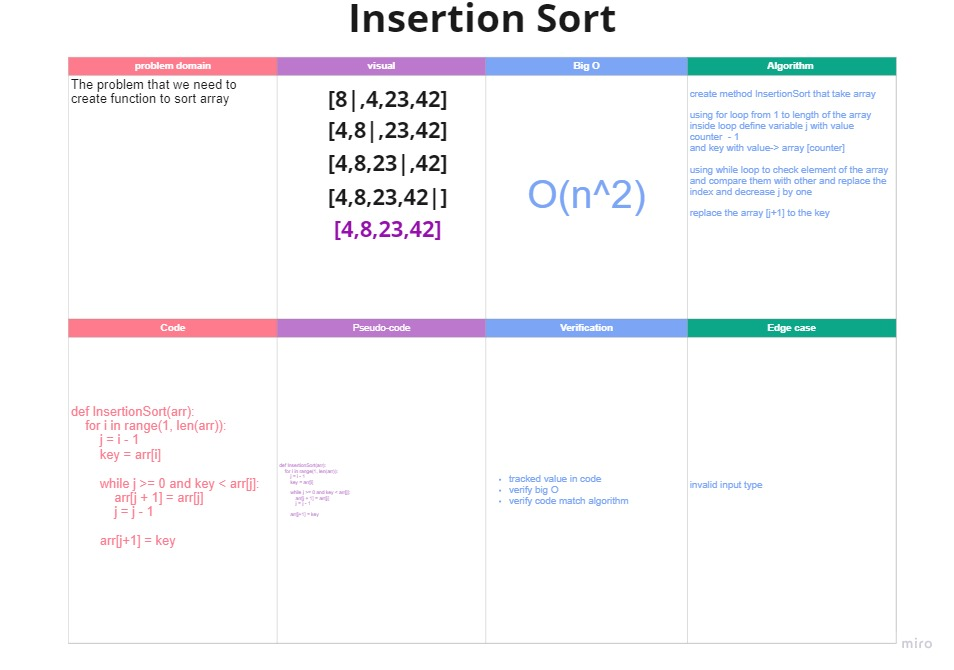

# Insertion Sort

Insertion Sort is a sorting algorithm that traverses the array multiple times as it slowly builds out the sorting sequence

so first of all you get the length of the array

inside a loop:

you assign a variable for the index 0

then you assign a variable for the one after

then check which one is bigger and swap their locations if required

example code:

```
def insertion_sort(arr):
    n = len(arr)
    for i in range(n-1):
        min_ = i
        j=i+1
        for f in range(n-1):
            if arr[j] < arr[min_]:
                min_ = j
            j +=1
            if j > n-1:
                break

        temp = arr[min_]
        arr[min_] = arr[i]
        arr[i] = temp
```


## Solution
> create method InsertionSort that take array
> using for loop from 1 to length of the array
> inside loop define variable j with value counter  - 1 and key with value-> array [counter]
> using while loop to check element of the array and compare them with other and replace the index and decrease j by one
> replace the array [j+1] to the key

[Insertion Sort](https://miro.com/app/board/o9J_lG44R2c=/)


