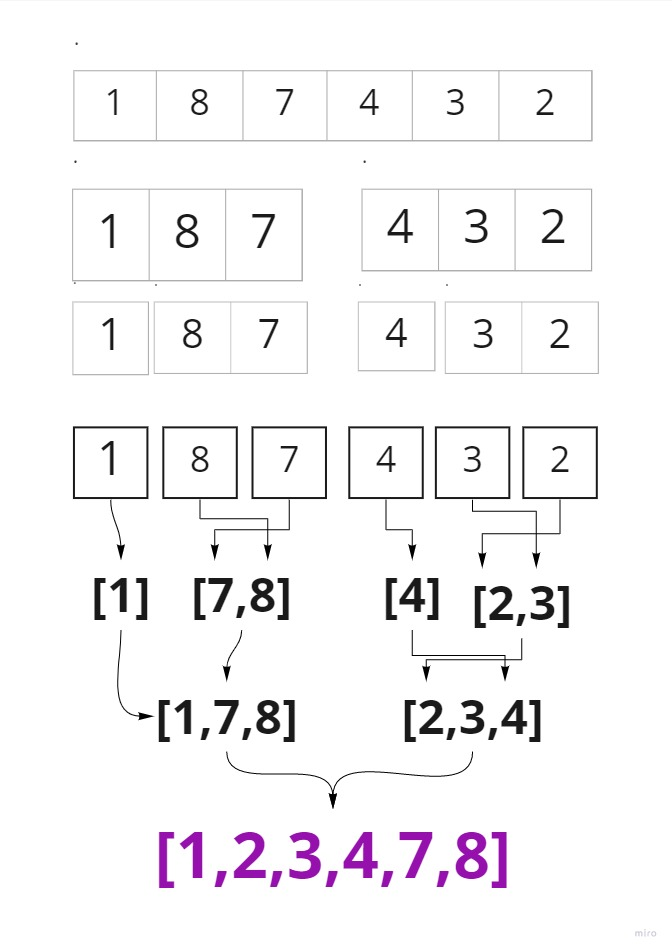

# quick_sort

quick_sort is a Divide and Conquer algorithm. It divides the input array into two halves, calls itself for the two halves, and then merges the two sorted halves.

take the array

split in 2 after getting length

split every part repeatedly until single elements left using recursion save it as left and right of every part

assign pointers for the left and right and the parent part indexes
using pointers values in their index compare values in the left and right

assign values to the parent using it's pointer,
do the same repeatedly till to left and right for every parent

## Trace:

example code:

```
def quick_sort(arr):
    n = len(arr)

    if n > 1:
        mid = n//2
        left = arr[0:mid]
        right = arr[mid:n]

        merge_sort(left)
        merge_sort(right)

        merge(left, right, arr)

def merge(left, right, arr):
    i = 0
    j = 0
    k = 0

    while i < len(left) and j < len(right):

        if left[i] <= right[j]:
            arr[k] = left[i]
            i = i + 1
        else:
            arr[k] = right[j]
            j = j + 1

        k +=1

    while i < len(left):
        arr[k] = left[i]
        i += 1
        k += 1

    while j < len(right):
        arr[k] = right[j]
        j += 1
        k += 1

```

Sample array: [8,4,23,42,16,15]


