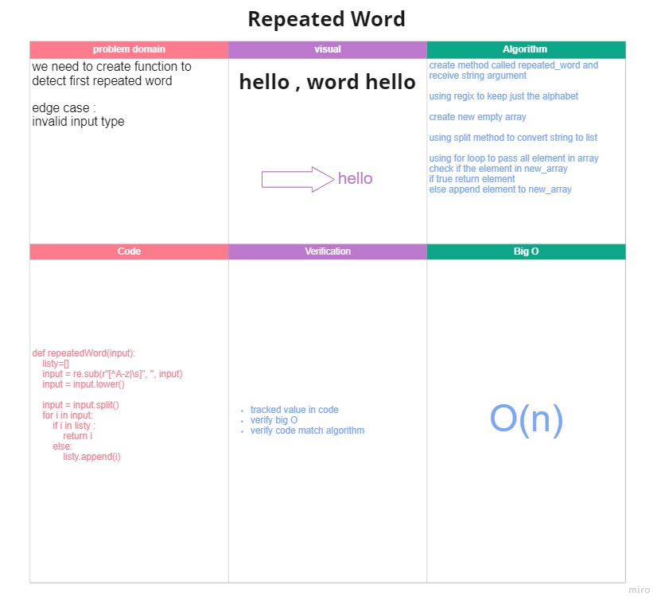

# Repeated Word
## challenge
- we need to create function to detect first repeated word

- edge case :
invalid input type

## Approach & Efficiency
- create method called repeated_word and receive string argument

- using regix to keep just the alphabet

- create new empty array

- using split method to convert string to list

- using for loop to pass all element in array
- check if the element in new_array
- if true return element
- else append element to new_array

## Big O
time O(n)
space O(n)

whiteboard

