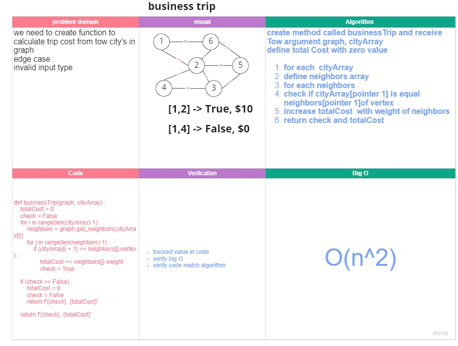
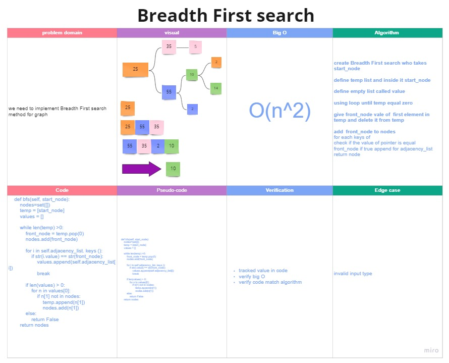

# 35- Graphs
A Graph is a non-linear data structure consisting of nodes and edges. The nodes are sometimes also referred to as vertices and the edges are lines or arcs that connect any two nodes in the graph.

## Challenge Description
Implement your own Graph. The graph should be represented as an adjacency list

## Approach & Efficiency

used a list to hold the visited nodes instead of a queue

Big O of time --> O(n^2)
Big O of space --> O(n)

## API

**add_node():**
Adds a new node to the graph, Takes in the value of that node and Returns the added node

**add_edge():**
Adds a new edge between two nodes in the graph
Include the ability to have a “weight”
Takes in the two nodes to be connected by the edge
Both nodes should already be in the Graph

**get_nodes():**
Returns all of the nodes in the graph as a collection (set, list, or similar)

**get_neighbors():**
Returns a collection of edges connected to the given node
Takes in a given node
Include the weight of the connection in the returned collection

**size():**
Returns the total number of nodes in the graph

# business trip
we need to create function to calculate trip cost from tow city's in graph
edge case :
invalid input type

## Approach & Efficiency
create method called businessTrip and receive Tow argument graph, cityArray
define total Cost with zero value

for each  cityArray
define neighbors array
for each neighbors
check if cityArray[pointer 1] is equal  neighbors[pointer 1]of vertex
increase totalCost  with weight of neighbors
return check and totalCost

## bIG O
TIME : O(n^2)
space : O(n)

